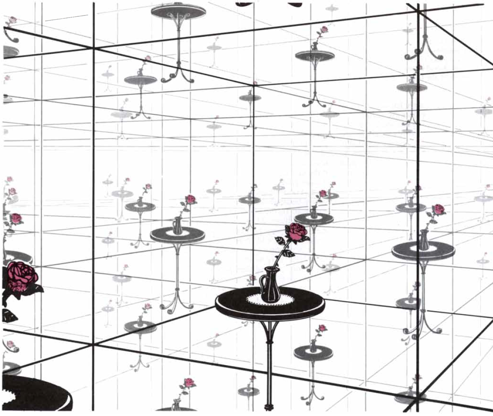
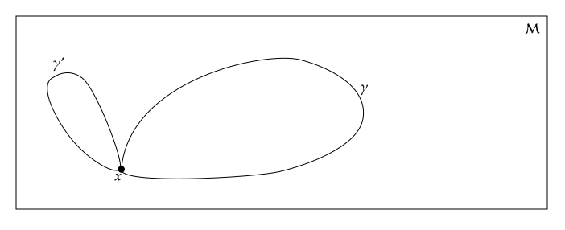
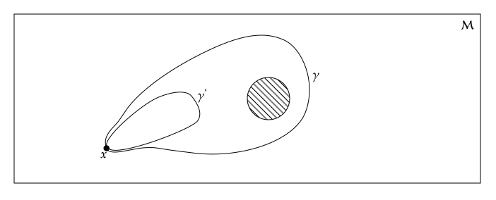
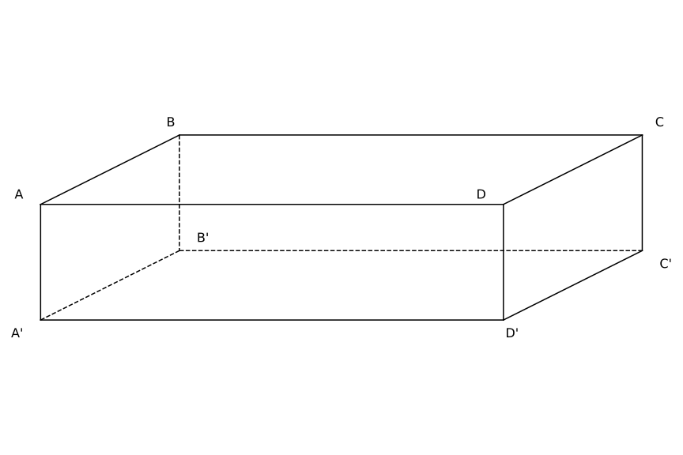
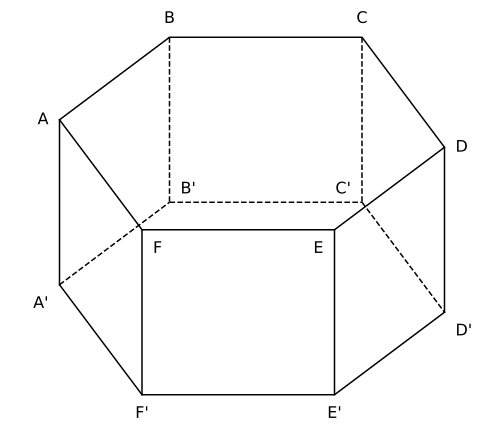

# Introduction
## Motivation

The notion that one geometry can be assigned by more than one topology is very old. Even Einstein and de Sitter noted that the $dS$ geometry which was discovered in the topology $\mathbb{R}^1 \times \mathbb{S}^3$ also admits the topology $\mathbb{R}^1 \times \mathbb{P}^3$. 

<!--Another example is the $AdS$  geometry first discovered in the topology $\mathbb{R}^1 \times \mathbb{S}^3$ but also admis the topology $\mathbb{R}^1\times \mathbb{R}^3$-->

The cosmological solution FLRW metric also admits more than one topology ($\mathbb{E}^3$, $\mathbb{S}^3$, $\mathbb{H}^3$). Howerver, the most common assumption is that the topology of the Universe is simply connected, but there is no reason bayond simplicity to assume this. In fact, there are some indications that the Universe may be multiply connected:

- Quantum processes in the early Universe may have created a non-trivial topology;
- The closure of of space ins considered as a necessaty condition for quantum theories of gravity;
- The universe can be finite and multiply connected, but still have a flat geometry;
- The comisc microwave background (CMB) apresent a statiscally anisotopic correlations, that would result from a non-trivial topology.

Thus, the cosmic topology refers the study of the spatial sections of the manifold describing the Universe, in the largest scales, in other words, the global properties of the Universe. 

<!--The main goal of this field is to determine the shape and size of the Universe and to find out if the Universe is finite or infinite, and if it is multiply conncected or simply connected-->
## Goals

The main objetives of this work are:

:::{.incremental}

- Show that the cosmic topology remains eminently detectable;

- Demonstrate that previous analyses have not considered several degrees of freedom;

- Show that the constraints to from nonobservations of matching circles are less restricive than previously thought;

- Demonstrate that anisotropic CMB correlations induced by topology can be detected even absent matching circles.

:::

# Topology
## What is topology?

The mathematical framework that studies the continuity of manifolds: topological properties are invariant under continuous deformations: stretching, squeezing, or kneading don't change the topological properties of a manifold. On the other hand, cutting, tearing, or making holes changes them.

Class 1: Soccer ball, rugby ball, and a plate are topologically equivalent;

Class 2: A coffee cup, a curtaing ring, and a doounut are topologically equivalent;

## Homeomorphism

The continuous transformations are mathematically desccribed by homeomorphisms. 

Consider the two manifolds $\mathcal{M}_1$ and $\mathcal{M}_2$. A homeomorphism is a continuous map $f: \mathcal{M}_1 \to \mathcal{M}_2$ that has a continuous inverse $f^{-1}: \mathcal{M}_2 \to \mathcal{M}_1$. 

If there exists a homeomorphism between two manifolds, they are said to be homeomorphic. 

Homeomorphic manifolds belongs to the same topological class. Thus, the topological works is classifying manifolds into topological classes.

## 2D Torus

```{python}
#| echo: false
#| output: false
#| cache: true

from manim import *

# Configurações do Manim para integração perfeita
config.media_dir = "./media_manim"
config.verbosity = "ERROR" # Suprime os logs e avisos
config.transparent = True  # Ativa o fundo transparente
config.format = "webm"     # Formato obrigatório para transparência
config.pixel_height = 720
config.pixel_width = 1280
config.frame_rate = 30
config.output_file = "TorusMorph"

class TorusMorph(ThreeDScene):
    def construct(self):
        self.set_camera_orientation(phi=65 * DEGREES, theta=45 * DEGREES)
        t1 = ValueTracker(0.001)
        t2 = ValueTracker(0.001)

        def morph(u, v):
            val_t1 = t1.get_value()
            val_t2 = t2.get_value()
            R, r = 2.5, 1.0 
            
            r_eff = r / val_t1
            cx = r_eff * np.sin(val_t1 * u)
            cz = r_eff * (1 - np.cos(val_t1 * u)) - (r * val_t1)
            
            R_eff = R / val_t2
            rho = R_eff + cz
            x = rho * np.cos(val_t2 * v) - R_eff + (R * val_t2)
            y = rho * np.sin(val_t2 * v)
            z = cx
            return np.array([x, y, z])

        surface = always_redraw(
            lambda: Surface(
                morph,
                u_range=[-PI, PI],
                v_range=[-PI, PI],
                resolution=(24, 24),
                fill_opacity=0.8,
                checkerboard_colors=['#003366', '#003366']
            )
        )

        self.add(surface)
        self.play(t1.animate.set_value(1), run_time=3)
        self.wait(0.5)
        self.play(t2.animate.set_value(1), run_time=3)
        self.wait(1)
        self.move_camera(phi=45 * DEGREES, theta=135 * DEGREES, run_time=4)

# Executa a renderização internamente
scene = TorusMorph()
scene.render()
```

```{python}
#| echo: false
#| output: false
#| cache: true

from manim import *

config.media_dir = "./media_manim"
config.verbosity = "ERROR"
config.transparent = True
config.format = "webm"
config.pixel_height = 720*2
config.pixel_width = 1280*2
config.frame_rate = 30
config.output_file = "ToroPlano"

class ToroPlano(Scene):
    def construct(self):
        # Dimensões dinâmicas (10x6 preenche muito bem a tela sem cortar as letras)
        largura, altura = 10, 6 
        
        # Fatores dinâmicos para a trajetória escalar junto com o retângulo
        sx = largura / 6.0
        sy = altura / 4.0
        
        # 1. O Retângulo Fundamental e Eixos
        retangulo = Rectangle(width=largura, height=altura, color='#696969', fill_opacity=0.1)
        
        eixo_y = DashedLine(UP*(altura/2), DOWN*(altura/2), color=GRAY, dash_length=0.1)
        eixo_x = DashedLine(LEFT*(largura/2), RIGHT*(largura/2), color=GRAY, dash_length=0.1)
        
        # Marcadores Topológicos e Letras amarrados às bordas dinâmicas
        seta_cima = Triangle(color='#696969', fill_opacity=1).scale(0.15).rotate(-PI/2).move_to(UP * (altura/2))
        seta_baixo = Triangle(color='#696969', fill_opacity=1).scale(0.15).rotate(-PI/2).move_to(DOWN * (altura/2))
        label_i_cima = MathTex("I", color='#696969', font_size=36).next_to(seta_cima, UP, buff=0.1)
        label_i_baixo = MathTex("I", color='#696969', font_size=36).next_to(seta_baixo, DOWN, buff=0.1)
        
        setas_esq = VGroup(
            Triangle(color="#696969", fill_opacity=1).scale(0.15).rotate(-PI/2),
            Triangle(color="#696969", fill_opacity=1).scale(0.15).rotate(-PI/2)
        ).arrange(RIGHT, buff=0.1).rotate(PI/2).move_to(LEFT * (largura/2))
        setas_dir = VGroup(
            Triangle(color="#696969", fill_opacity=1).scale(0.15).rotate(-PI/2),
            Triangle(color="#696969", fill_opacity=1).scale(0.15).rotate(-PI/2)
        ).arrange(RIGHT, buff=0.1).rotate(PI/2).move_to(RIGHT * (largura/2))
        label_j_esq = MathTex("J", color='#696969', font_size=36).next_to(setas_esq, LEFT, buff=0.1)
        label_j_dir = MathTex("J", color='#696969', font_size=36).next_to(setas_dir, RIGHT, buff=0.1)
        
        self.add(retangulo, eixo_x, eixo_y) #seta_cima, seta_baixo, setas_esq, setas_dir)
        self.add(label_i_cima, label_i_baixo, label_j_esq, label_j_dir)

        # 2. A Partícula
        bolinha = Dot(color='#003366', radius=0.15)
        
        # Coordenadas da trajetória reescaladas proporcionalmente
        ponto_inicial = np.array([-1.5 * sx, 1 * sy, 0])
        ponto_i_cima  = np.array([0, altura/2, 0])
        ponto_i_baixo = np.array([0, -altura/2, 0])
        ponto_j_dir   = np.array([largura/2, -0.5 * sy, 0])
        ponto_j_esq   = np.array([-largura/2, -0.5 * sy, 0])
        ponto_final   = np.array([1 * sx, 1.5 * sy, 0])

        bolinha.move_to(ponto_inicial)
        rastro = TracedPath(bolinha.get_center, stroke_color="#003366", stroke_opacity=0.6, stroke_width=4)
        self.add(rastro, bolinha)

        # 3. Motor de Velocidade Constante
        # A velocidade determina o tempo baseado na distância percorrida
        velocidade = 3.0 
        def tempo(p1, p2):
            return np.linalg.norm(p2 - p1) / velocidade

        # 4. Trajetória 1 (Rumo a I superior)
        self.play(bolinha.animate.move_to(ponto_i_cima), run_time=tempo(ponto_inicial, ponto_i_cima), rate_func=linear)
        
        # Teletransporte 1
        rastro.clear_updaters() 
        bolinha.move_to(ponto_i_baixo)
        rastro2 = TracedPath(bolinha.get_center, stroke_color="#003366", stroke_opacity=0.6, stroke_width=4)
        self.add(rastro2)
        
        # 5. Trajetória 2 (Rumo a J direito)
        self.play(bolinha.animate.move_to(ponto_j_dir), run_time=tempo(ponto_i_baixo, ponto_j_dir), rate_func=linear)
        
        # Teletransporte 2
        rastro2.clear_updaters()
        bolinha.move_to(ponto_j_esq)
        rastro3 = TracedPath(bolinha.get_center, stroke_color="#003366", stroke_opacity=0.6, stroke_width=4)
        self.add(rastro3)
        
        # 6. Trajetória 3 (Interior do retângulo)
        self.play(bolinha.animate.move_to(ponto_final), run_time=tempo(ponto_j_esq, ponto_final), rate_func=linear)
        
        self.wait(1)

scene = ToroPlano()
scene.render()
```

:::: {.columns}

::: {.column width="50%"}

One way to construct topological surfaces is by identifying edges pairs of polygons and suitably gluing them together. 

For example consider a rectangle:

 - Identifying the top and bottom edges, we obtain a cylinder;

 - Identifying the left and right edges of the cylinder, we obtain a torus.


::: {.fragment}
```{=html}
<video data-autoplay muted playsinline style="width: 100%; display: block; margin: 0 auto; pointer-events: none; border: none; background: transparent;">
  <source src="./media_manim/videos/720p30/TorusMorph.webm" type="video/webm">
</video>
```
:::

:::

::: {.column width="50%"}

The $\mathbb{S}^1\times \mathbb{S}^1$ torus which is flat everywhere, and despite the diagram, it is not like that. 

The original rectangle is the fundamental domain of the torus. If one moves in the fundamental domain and reaches one of its edges, he/she will reapear in the opposite edge, a to called equivalent point.

::: {.fragment}
```{=html}
<video data-autoplay muted playsinline style="width: 100%; display: block; margin: 0 auto; pointer-events: none; border: none; background: transparent;">
  <source src="./media_manim/videos/1440p30/ToroPlano.webm" type="video/webm">
</video>
```
:::

:::

::::

## The 3-Torus

:::: {.columns}

::: {.column width="40%"}

Using again the same idea of identifying edges of a polygon, we can construct the 3-torus: $\mathbb{S}^1\times \mathbb{S}^1\times \mathbb{S}^1$.

The light emitted backwards crosses the faces of the parallelepiped behind us and reapears in opposite face in front of us. As the light propagates in all directions, we would see an infinity of images of any object in all angles. 


:::

::: {.column width="60%"}
<!--{.absolute .fragment right="10" top="50" width="50%" height="50%"}-->
:::

::::


## Homotopy

First we define the loop in $\mathcal{M}$ as a path wich starts and ends at the same point $\mathbf{x}$.

Two loops $\gamma$ and $\gamma'$ are homotopic if $\gamma$ can be continuously deformed into $\gamma'$.

:::: {.columns}

::: {.column width="50%"}

::: {style="border-right: 2px solid #003366; text-align: center;"}

{width="85%"}<!--{.absolute .fragment right="10" top="50" width="50%" height="50%"}-->
:::

:::

::: {.column width="50%"}
::: {style="padding-left: 3%; text-align: center;"}
{width="85%"}
:::
:::

::::

A manifold  is [simply connected]{.fragment .highlight-custom} if for any point $\mathbf{x}$, two loops are homotopic. If not the manifold is said to be [multi-connected]{.fragment .highlight-custom}. 

Some examples are

:::: {.columns}

::: {.column width="50%"}

::: {style="border-right: 2px solid #003366; padding-right: 5%;"}

:::{.fragment .highlight-custom style="text-align: center;"}
Simple connected
:::

- Euclidean spaces: $\mathbb{R}^1$, $\mathbb{R}^2$, ..., $\mathbb{R}^n$;

- Spheres: $\mathbb{S}^2$, $\mathbb{S}^3$, ..., $\mathbb{S}^n$.

:::
:::

::: {.column width="50%"}
::: {style="padding-left: 5%;"}
:::{.fragment .highlight-custom style="text-align: center;"}
Multi-connected 
:::

- Circle: $\mathbb{S}^1$;

- Cylinder: $\mathbb{S}^1\times \mathbb{R}$

- Torus: $\mathbb{S}^1\times \mathbb{S}^1$, $\mathbb{S}^1\times \mathbb{S}^1\times \mathbb{S}^1$;

:::
:::

::::

## Fundamental Group of the cylinder

The first fundamental group $\pi_1(\mathcal{M}, \mathbf{x})$ of a manifold $\mathcal{M}$ is the set of all homotopy classes of loops based at $\mathbf{x}$.

:::: {.columns}

::: {.column width="50%"}

::: {style="border-right: 2px solid #003366; text-align: center;"}

{width="85%"}<!--{.absolute .fragment right="10" top="50" width="50%" height="50%"}-->

Any loop can be deformed to a one point, the group is just the identity.

:::

:::

::: {.column width="50%"}
::: {style="padding-left: 3%; text-align: center;"}
{width="85%"}

The loops $\gamma$ and $\gamma'$ aren't homotopics. The group here is $\mathbb{Z}$ de inteiros related to the homotopic classes.

:::
:::

::::

As the manifold is connected the fundamental group for any point $\mathbf{x}$ is isomorphic to the fundamental group at any other point $\mathbf{x}'$. Thus, $\pi_1(\mathcal{M}, \mathbf{x})$ is independent of the base point and [it is a topological invariant of the manifold $\mathcal{M}$]{.fragment .highlight-custom}.


## The Universal Covering Space of the cylinder
```{python}
#| echo: false
#| output: false
#| cache: true

from manim import *
import numpy as np

config.media_dir = "./media_manim"
config.verbosity = "ERROR"
config.transparent = True
config.format = "webm"
config.pixel_height = 720
config.pixel_width = 1280
config.frame_rate = 30
config.output_file = "CoveringSpace"

class CoveringSpace(Scene):
    def construct(self):
        # ==========================================
        # 1. O CILINDRO (Deslocado um pouco para a direita para caber na tela)
        # ==========================================
        cyl_center = np.array([-4.0, 0, 0])
        cyl_w = 3.0
        cyl_h = 4.5
        
        cyl_top = Ellipse(width=cyl_w, height=0.7, color="#000000", stroke_width=3).move_to(cyl_center + UP*(cyl_h/2))
        cyl_bot = Ellipse(width=cyl_w, height=0.7, color="#000000", stroke_width=3).move_to(cyl_center + DOWN*(cyl_h/2))
        
        cyl_left = Line(cyl_bot.get_left(), cyl_top.get_left(), color="#000000", stroke_width=3)
        cyl_right = Line(cyl_bot.get_right(), cyl_top.get_right(), color="#000000", stroke_width=3)
        
        z_top_band = 1.0
        z_bot_band = -1.0
        
        # Correção do eixo de delimitação inferior (agora UP * z_bot_band que é UP * -1 = DOWN)
        arc_top_front = ArcBetweenPoints(cyl_center + LEFT*(cyl_w/2) + UP*z_top_band, 
                                         cyl_center + RIGHT*(cyl_w/2) + UP*z_top_band, angle=-PI/4, color="#000000", stroke_width=3)
        arc_bot_front = ArcBetweenPoints(cyl_center + LEFT*(cyl_w/2) + UP*z_bot_band, 
                                         cyl_center + RIGHT*(cyl_w/2) + UP*z_bot_band, angle=-PI/4, color="#000000", stroke_width=3)
        
        arc_top_back_base = ArcBetweenPoints(cyl_center + RIGHT*(cyl_w/2) + UP*z_top_band, 
                                        cyl_center + LEFT*(cyl_w/2) + UP*z_top_band, angle=-PI/4, color="#000000")
        arc_top_back = DashedVMobject(arc_top_back_base, num_dashes=15)
        
        arc_bot_back_base = ArcBetweenPoints(cyl_center + RIGHT*(cyl_w/2) + UP*z_bot_band, 
                                        cyl_center + LEFT*(cyl_w/2) + UP*z_bot_band, angle=-PI/4, color="#000000")
        arc_bot_back = DashedVMobject(arc_bot_back_base, num_dashes=15)

        # Preenchimento
        pts_bot = arc_bot_front.get_points()
        pts_top = arc_top_front.get_points()[::-1] 
        band_fill = Polygon(*pts_bot, *pts_top, fill_color="#000000", fill_opacity=0.2, stroke_width=0)

        # Nome D' no tom roxo
        label_D_prime = MathTex("D", color="#000000", font_size=36).move_to(cyl_center + UP*1.4 + LEFT*0.8)

        self.add(band_fill, cyl_top, cyl_bot, cyl_left, cyl_right)
        self.add(arc_top_front, arc_bot_front, arc_top_back, arc_bot_back, label_D_prime)

        # ==========================================
        # 2. TRAJETÓRIAS NO CILINDRO
        # ==========================================
        pt_x = cyl_center + DOWN*0.5 + LEFT*0.7
        pt_x_prime = cyl_center + UP*0.5 + RIGHT*0.7
        
        # Pontos e letras agora em Grafite Escuro para aparecer no slide
        dot_x = Dot(pt_x, color="#000000", radius=0.06)
        dot_x_prime = Dot(pt_x_prime, color="#000000", radius=0.06)
        label_x = MathTex("x", color="#000000", font_size=32).next_to(pt_x, DOWN+LEFT, buff=0.1)
        label_x_prime = MathTex("x'", color="#000000", font_size=32).next_to(pt_x_prime, UP+RIGHT, buff=0.1)
        
        gamma1 = Arrow(pt_x, pt_x_prime, path_arc=-0.3, color="#000000", stroke_width=3, tip_length=0.15)
        label_g1 = MathTex(r"\gamma_1", color="#000000", font_size=32).move_to(pt_x + UP*0.6 + RIGHT*0.2)
        
        pt_R = cyl_center + RIGHT*(cyl_w/2) + DOWN*0.1
        pt_L = cyl_center + LEFT*(cyl_w/2) + UP*0.1
        
        g2_part1 = ArcBetweenPoints(pt_x, pt_R, angle=-0.2, color="#000000", stroke_width=3)
        g2_part2_base = ArcBetweenPoints(pt_R, pt_L, angle=-PI/4, color="#000000", stroke_width=3)
        g2_part2 = DashedVMobject(g2_part2_base, num_dashes=10) 
        g2_part3 = Arrow(pt_L, pt_x_prime, path_arc=-0.2, color="#000000", stroke_width=3, tip_length=0.15)
        label_g2 = MathTex(r"\gamma_2", color="#000000", font_size=32).move_to(pt_R + DOWN*0.3 + LEFT*0.5)

        self.add(dot_x, dot_x_prime, label_x, label_x_prime)
        self.add(gamma1, label_g1, g2_part1, g2_part2, g2_part3, label_g2)

        # ==========================================
        # 3. SETA CENTRAL DE MAPEAMENTO
        # ==========================================
        #333333
        mapping_arrow = Arrow(LEFT*1.2, RIGHT*0.2, color="#000000", stroke_width=5, tip_length=0.2)
        self.add(mapping_arrow)

        # ==========================================
        # 4. O PLANO DE RECOBRIMENTO (Direita) - Redimensionado para não cortar!
        # ==========================================
        p_bl = np.array([ 0.5, -2.5, 0])
        p_br = np.array([ 5.5, -2.5, 0])
        p_tr = np.array([ 6.5,  2.5, 0])
        p_tl = np.array([ 1.5,  2.5, 0])
        plane = Polygon(p_bl, p_br, p_tr, p_tl, color="#000000", fill_opacity=0, stroke_width=3)
        
        x_tl_band = 1.2
        x_bl_band = 0.8
        
        band_plane = Polygon(
            np.array([x_bl_band, -1.0, 0]), 
            np.array([x_bl_band + 5.0, -1.0, 0]), 
            np.array([x_tl_band + 5.0,  1.0, 0]), 
            np.array([x_tl_band,  1.0, 0]), 
            fill_color="#000000", fill_opacity=0.2, stroke_color="#000000", stroke_width=2
        )
        label_Delta_prime = MathTex(r"\Delta", color="#000000", font_size=36).move_to(np.array([1.8, 1.4, 0]))

        self.add(plane, band_plane, label_Delta_prime)

        # ==========================================
        # 5. TRAJETÓRIAS NO PLANO (Levantamentos)
        # ==========================================
        X_base = np.array([1.3, -0.6, 0])
        T_vec = np.array([1.4, 0, 0]) 
        
        X_prime = X_base + UP*1.1 + RIGHT*0.9
        X_double_prime = X_prime + T_vec
        X_triple_prime = X_double_prime + T_vec
        
        dots_plane = VGroup(
            Dot(X_base, color="#000000", radius=0.06),
            Dot(X_prime, color="#000000", radius=0.06),
            Dot(X_double_prime, color="#000000", radius=0.06),
            #Dot(X_triple_prime, color="#000000", radius=0.06)
        )
        
        labels_plane = VGroup(
            MathTex("X", color="#000000", font_size=32).next_to(X_base, DOWN+LEFT, buff=0.1),
            MathTex("X'", color="#000000", font_size=32).next_to(X_prime, UP, buff=0.1),
            MathTex("X''", color="#000000", font_size=32).next_to(X_double_prime, UP, buff=0.1),
           #MathTex("X'''", color="#000000", font_size=32).next_to(X_triple_prime, UP, buff=0.1)
        )

        Gamma1 = Arrow(X_base, X_prime, color="#000000",  stroke_width=3, tip_length=0.15, buff=0)
        label_Gamma1 = MathTex(r"\Gamma_1", color="#000000", font_size=32).move_to(X_base + UP*0.7 + LEFT*.0001)
        
        Gamma2 = Arrow(X_base, X_double_prime, color="#000000", stroke_width=3, tip_length=0.15, buff=0)
        label_Gamma2 = MathTex(r"\Gamma_2", color="#000000", font_size=32).move_to(X_base + UP*0.2 + RIGHT*1.2)

        self.add(dots_plane, labels_plane, Gamma1, Gamma2, label_Gamma1, label_Gamma2)
        
        self.wait(1)

scene = CoveringSpace()
scene.render()

```

Let $\mathcal{D}$ be a domain on a cylinder, bounded by two circular sections. If we unrroll the cylinder onto a plane, the correspondece between the $\mathcal{D}$ and the projected region $\Delta$, called _development_, is no longer one-to-one.

:::: {.columns}

::: {.column width="60%"}

```{=html}
<video data-autoplay muted playsinline style="width: 100%; max-width: 900px; display: block; margin: 0 auto; pointer-events: none; border: none; background: transparent;">
  <source src="./media_manim/videos/720p30/CoveringSpace.webm" type="video/webm">
</video>
```
:::

::: {.column width="40%"}

One point $x$ and path $\gamma$ to a point $x'$ can be developed into a point $X$ and a path $\Gamma$ in the plane. 

For a multiply connect domain $\mathcal{D}$  multi-connect there will be several paths $\gamma^1, \gamma^2, \dots$ from $x$ to $x'$, such that in their development, the corresponding paths $\Gamma_1, \Gamma_2, \dots$ generate distincts points $X', x'', \dots$ on $\mathbb{R}^2$

:::

::::

::: {.fragment .highlight-custom style="text-align: center;"}

The plane $\mathbb{R}^2$ is the universal covering space for the cylinder.

:::


## The Universal Covering Space

This ideia can be extended to any manifold throught the following procedure:

- Consider $\mathcal{M}$ endowed with a metric $g$. Choose a base point $x_0$ and consider all paths from this point to another point $y$. We build the covering space as a manifold $(\mathcal{C}, h)$ in which every point is obtained from a pair $(y, \gamma_i)$, varying $y$ in all of $\mathcal{M}$.

- The metric $h$ is obtained by defining the interval between $\bar x(x, \gamma)$ and a nearby point $\bar x'(x', \gamma)$ to be equal to the interval ibetween the corresponding points $x$ and $x'$ in $\mathcal{M}$.

By construction, the two manifolds are identical locally. However, they can be topologically distinct:

- If $\mathcal{M}$ is simply connected, it is identical to $\mathcal{C}$;

- If $\mathcal{M}$ is multiply connected, evey point in $\mathcal{M}$ generates multiple distinct points in $\mathcal{C}$.

::: {.fragment .highlight-custom style="text-align: center;"}

The universal covering space can be understood as "wrapping" of the original manifold.

:::

# 3d Euclidean space forms
## The Euclidean Space

The metric for the universial covering space, representing flat spatial geometry, is given by
$$
ds^2 = R^2 (dr^2+ r^2 d\theta^2+\sin{\theta}^2d\phi^2)
$$
Including this universal space, there are 18 flat space forms in total

- 8 are non-compact (open);

- 10 are compact (closed)

We will focus in the compact ones, as the non-compact forms lack discrete eigenmodes. Of the ten compact forms, only six are orientable, and these will be the subject of our discussion.

We can construct all possible manifolds starting from a parallelepiped or hexagonal prisms and using the glueing procedure.

## Compact Forms from Parallelepiped


:::: {.columns}

::: {.column width="50%"}



::: {.incremental style="font-size:0.9em"}
- $E_{18}$: The parallelipiped itself, it is the fundamental domain.
:::

:::

::: {.column width="50%"}

::: {.incremental style="font-size:0.9em"}

- $E_1$ Opposite faces united's by translation:
$$
\begin{aligned}
ABCD \quad &\Longleftrightarrow\quad A'B'C'D'\\
ABB'A' \quad &\Longleftrightarrow\quad DCC'D'\\
ADD'A' \quad &\Longleftrightarrow\quad BCC'D'
\end{aligned}
$$

- $E_2$ Opposite faces united's one pair rotated by $\pi$:
$$
\begin{aligned}
ABCD \quad &\Longleftrightarrow\quad C'D'A'B'\\
ABB'A' \quad &\Longleftrightarrow\quad DCC'D'\\
ADD'A' \quad &\Longleftrightarrow\quad BCC'D'
\end{aligned}
$$

- $E_3$ Opposite faces united's one pair rotated by $\pi/2$:
$$
\begin{aligned}
ABCD \quad &\Longleftrightarrow\quad B'C'D'A'\\
ABB'A' \quad &\Longleftrightarrow\quad DCC'D'\\
ADD'A' \quad &\Longleftrightarrow\quad BCC'D'
\end{aligned}
$$


- $E_4$ Opposite faces united's all three pairs rotated by $\pi$:
$$
\begin{aligned}
ABCD \quad &\Longleftrightarrow\quad C'D'A'B'\\
ABB'A' \quad &\Longleftrightarrow\quad C'D'D C\\
ADD'A' \quad &\Longleftrightarrow\quad C'B'B C
\end{aligned}
$$
:::
:::


::::

## Compact Forms from Hexagonal Prism


:::: {.columns}

::: {.column width="50%"}



:::

::: {.column width="50%"}

::: {.incremental style="font-size:0.9em"}

- $E_5$: Opposite faces together, the top face being rotated by an angle $2\pi/3$ with respect to the bottom face
$$
\begin{aligned}
ABCDEF \quad &\Longleftrightarrow\quad C'D'E'F'A'B'\\
AA'F'F \quad &\Longleftrightarrow\quad CC'D'D \\
EE'D'D \quad &\Longleftrightarrow\quad AA'B'B
\end{aligned}
$$

- $E_6$: Opposite faces together, the top face being rotated by an angle $\pi/3$ with respect to the bottom face
$$
\begin{aligned}
ABCDEF \quad &\Longleftrightarrow\quad B'C'D'E'F'A'\\
AA'F'F \quad &\Longleftrightarrow\quad CC'D'D \\
EE'D'D \quad &\Longleftrightarrow\quad AA'B'B
\end{aligned}
$$
:::

:::{.fragment}
The motion of rotation accompanied by translation is called of corkscrew motiom and this defines the [corckscrew axis]{.fragment .highlight-custom}.
:::
:::


::::

# The Eingmodes in Non-Trivial Topology
## Frame 

# The CMB temperature
## Frame 1

# Constraints to the Search
## Frame 1

# Conclusion
## Frame 1
